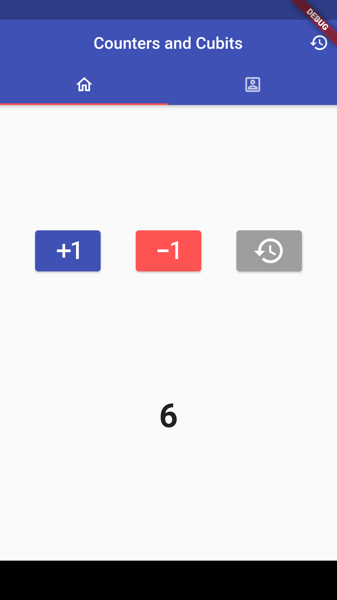
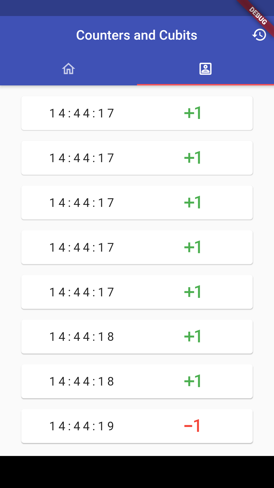

# counter_cubit_demo

A new Flutter project to test cubits with the initial counter app.

## funct

- We'll have a list of DateTimes where a button is clicked.
    - Similar to a logger.
- Three times of buttons:
    - Increase, decrease, reset.
- Uses cubits as a state management.
- We'll have a tab to choose between Home and Events pages.

## screens
### home and events

 